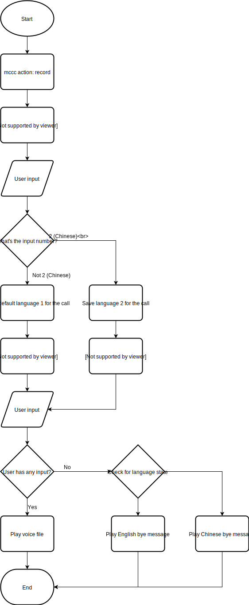

# Mocean Voice IVR Example

An example for Interactive Voice Response (IVR) written in Python using Flask and MoceanSDK. This simple IVR will showcase how a developer can perform the following actions using our programmable voice service:
  1. Record an entire conversation
  2. Use the Text-To-Speech(TTS) system to generate and play synthesised speech
  3. Obtain inputs from user for further processing
  4. Saving the state of a user's chosen path for further processing

The flow diagram for this sample IVR are as follow:



## Requirements
-   Python 3.6 or above
-   pip

## Installations
If you haven't cloned the repo, clone it by:
```sh
git clone git@github.com:MoceanAPI/mocean-voice-ivr-example-flask.git
```
Or if you do not want to setup a github account and setup SSH key:
```sh
git clone https://github.com/MoceanAPI/mocean-voice-ivr-example-flask.git
```
Or you can download the ZIP version and extract it.

Change your working directory to the repo by `cd mocean-voice-ivr-example-flask`, and run the following statement to install required packages:
```sh
pip install -r requirements.txt
```

## Usage
Start the application using the following command:
```sh
python3 app.py
```

**Note:** This is an example of how to create an IVR based on Mocean Voice GW. You might need to host to where it is accessible from the internet. If your server is setup behind a firewall, we recommend [ngrok](https://ngrok.com/) as a temporary measure to test the effectiveness of your application.
